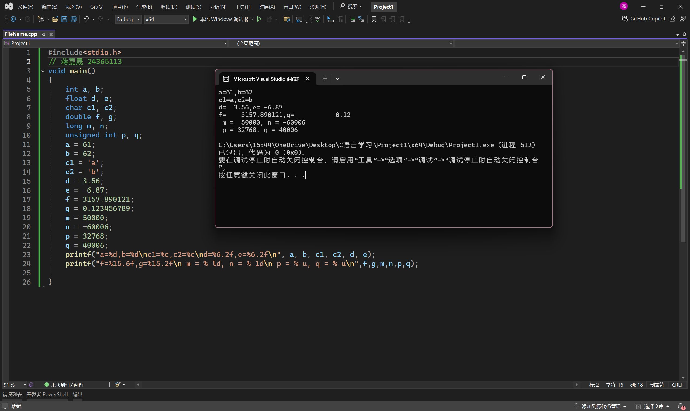
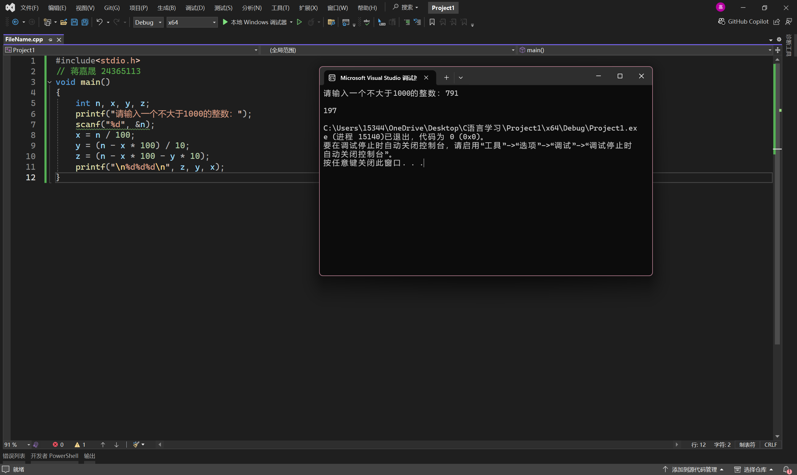
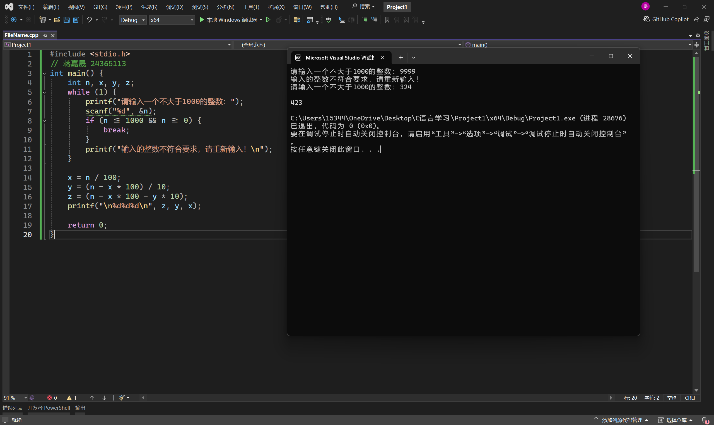
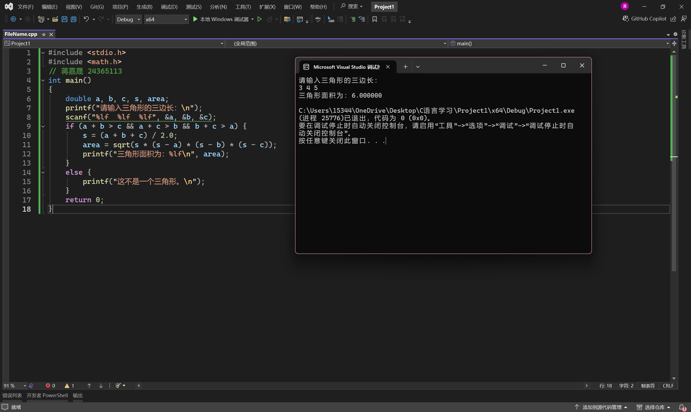

# 实验二 顺序结构实验程序设计

## 一、实验目的

1. 掌握C语言中使用最多、最基本的一种语句﹣﹣赋值语句的使用。
2. 掌握数据的输入输出方法，能正确使用各种格式转换符。
3. 熟悉顺序结构的程序设计方法。
4. 进一步掌握C语言程序的编辑、编译、连接和运行的过程。

## 二、实验准备

1. 复习C语言的赋值运算符，同时区分“=”和“==”的区别。
2. 复习printf 和scanf 的格式及要求。
3. 复习程序代码编写规范。

## 三、实验内容

1、输入并运行以下程序，调试并运行出结果
```
#include<stdio.h>
void main()
{
	int a, b;
	float d, e;
	char c1, c2;
	double f, g;
	long m, n;
	unsigned int p, q;
	a = 61;
	b = 62;
	c1 = 'a';
	c2 = 'b';
	d = 3.56;
	e = -6.87;
	f = 3157.890121;
	g = 0.123456789;
	m = 50000; 
	n = -60006;
	p = 32768; 
	q = 40006;
	printf("a=%d,b=%d\nc1=%c,c2=%c\nd=%6.2f,e=%6.2f\n", a, b, c1, c2, d, e);
	printf("f=%15.6f,g=%15.2f\n m = % ld, n = % 1d\n p = % u, q = % u\n",f,g,m,n,p,q);
}
```



2、运行程序并回答问题
```
#include<stdio.h>
void main()
{
	int n, x, y, z;
	printf("请输入一个不大于1000的整数：");
	scanf("%d", &n);
	x = n / 100;
	y = (n - x * 100) / 10;
	z = (n - x * 100 - y * 10);
	printf("\n%d%d%d\n", z, y, x);
}
```



问题：此程序的功能是什么？你能用其他方法实现同样的功能吗？请上机调试。

此程序的功能是将一个小于1000的数每一个数字倒序输出

其他方法（增加检查合法性输入的语句）




3、编写输入三角形三边长a，b，c，求三角形的面积area程序
```
#include <stdio.h>   
#include <math.h>     
int main() 
{
	double a, b, c, s, area;
	printf("请输入三角形的三边长：\n");
	scanf("%lf  %lf  %lf", &a, &b, &c);
	if (a + b > c && a + c > b && b + c > a) {
		s = (a + b + c) / 2.0;
		area = sqrt(s * (s - a) * (s - b) * (s - c));
		printf("三角形面积为：%lf\n", area);
	}
	else {
		printf("这不是一个三角形。\n");
	}
	return 0;
}
```


